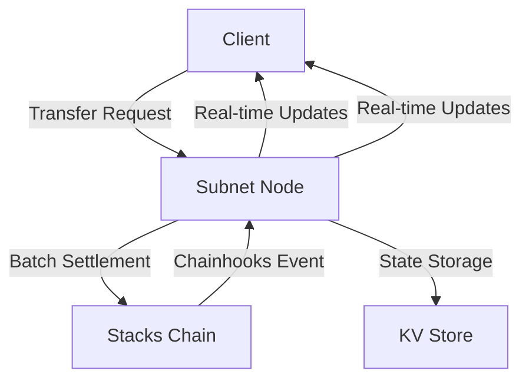
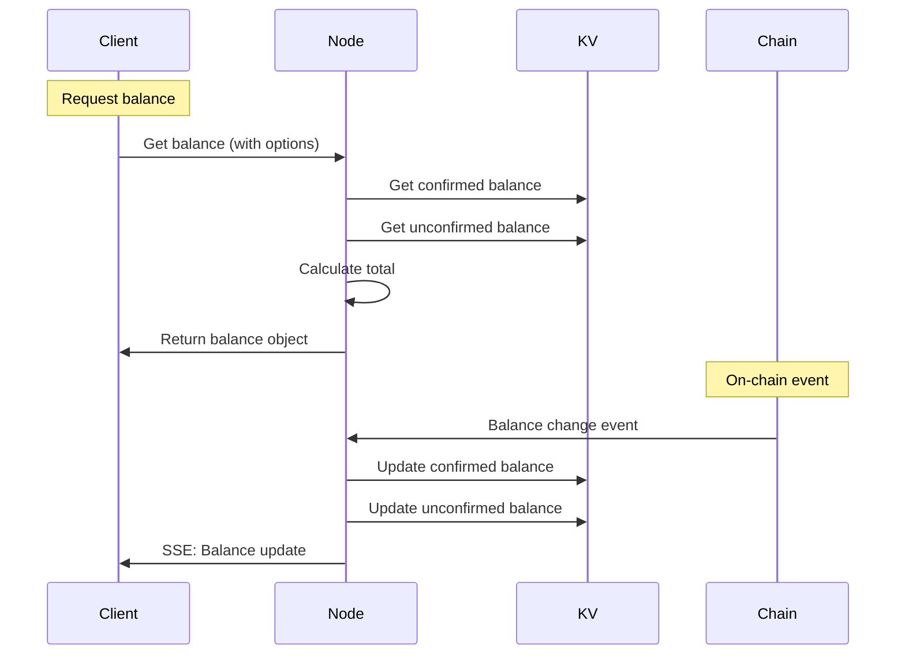
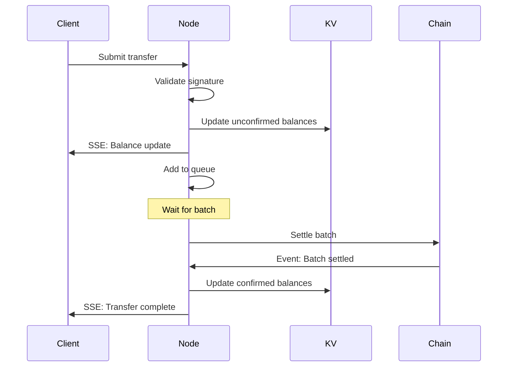
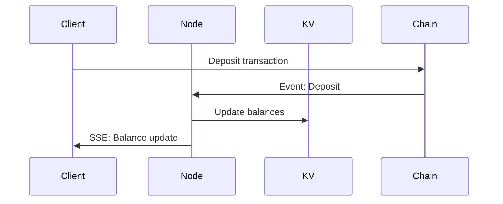

# Blaze Subnet Technical Architecture

This document outlines the technical architecture of the Blaze subnet system, including its components, data flow, and key technical decisions.

## System Overview

Blaze is a layer 2 scaling solution for Stacks that enables fast, off-chain transfers with on-chain settlement. It uses a subnet architecture where operators process transfers off-chain and periodically settle them on-chain in batches.



## Core Components

### 1. Client SDK

The client SDK provides a simple interface for applications to interact with Blaze subnets:

```typescript
class Blaze {
    // Core operations
    async transfer(options: TransferOptions): Promise<TransactionResult>
    async deposit(amount: number): Promise<FinishedTxData>
    async withdraw(amount: number): Promise<FinishedTxData>
    
    // Balance management
    async getBalance(options?: BalanceOptions): Promise<Balance>
    
    // Real-time updates
    subscribe(type: EventType, handler: (event: BlazeEvent) => void): EventSubscription
}

// Balance types
interface Balance {
    total: number;           // Total available balance (confirmed + unconfirmed)
    confirmed?: number;      // Optional: On-chain confirmed balance
    unconfirmed?: number;    // Optional: Pending unconfirmed balance
}

interface BalanceOptions {
    includeConfirmed?: boolean;    // Include confirmed balance in response
    includeUnconfirmed?: boolean;  // Include unconfirmed balance in response
}
```

Key features:
- Structured data signing for transfers
- SSE-based real-time updates
- Automatic reconnection with exponential backoff
- Flexible balance tracking (total/confirmed/unconfirmed)
- Optimized state management

### 2. Subnet Node

The subnet node is responsible for:
- Processing transfer requests
- Managing transfer queues
- Batch settlement on-chain
- State synchronization
- Real-time event streaming

```typescript
class Subnet {
    // Core operations
    async processTransfers(): Promise<TransactionResult>
    async addTransferToQueue(transfer: Transfer): Promise<void>
    
    // Balance management
    async getBalance(user: string, options?: BalanceOptions): Promise<Balance>
    async processDepositEvent(user: string, amount: number): Promise<void>
    async processWithdrawEvent(user: string, amount: number): Promise<void>
    async processTransferEvent(from: string, to: string, amount: number): Promise<void>
    
    // Event handling
    addEventClient(signer: string, callback: (event: BlazeEvent) => void): void
    removeEventClient(signer: string, callback: (event: BlazeEvent) => void): void
}
```

### 3. State Management

State is managed through a Vercel KV store or Redis instance with optimized balance tracking:

```typescript
// Balance key format
${contract}:${user}:${type} // type = 'confirmed' | 'unconfirmed'

// Balance operations
interface BalanceOperations {
    // Get balances
    async function getBalance(
        contract: string,
        user: string,
        options?: BalanceOptions
    ): Promise<Balance>

    // Update balances
    async function updateBalance(
        contract: string,
        user: string,
        amount: number,
        options?: BalanceOptions
    ): Promise<void>

    // Process events
    async function processDepositEvent(contract: string, user: string, amount: number): Promise<void>
    async function processWithdrawEvent(contract: string, user: string, amount: number): Promise<void>
    async function processTransferEvent(contract: string, from: string, to: string, amount: number): Promise<void>
}
```

## Data Flow

### 1. Balance Updates Flow



### 2. Transfer Flow



### 3. Deposit Flow



## Technical Decisions

### 1. Real-time Updates

**Decision**: Use Server-Sent Events (SSE) instead of WebSocket
- Better support in Edge Functions
- Simpler implementation
- Native browser support
- Automatic reconnection
- One-way communication sufficient for updates

### 2. State Management

**Decision**: Use Vercel KV/Redis
- Low latency
- High availability
- Built-in persistence
- Atomic operations
- Scalable

### 3. Batch Processing

**Decision**: Queue-based batch processing
- Configurable batch size
- Configurable processing interval
- Automatic queue management
- Error recovery

## Security Model

### 1. Transfer Security

Each transfer is secured by:
1. Structured data signature
2. On-chain signature verification
3. Balance checks
4. Nonce handling

### 2. Node Security

Nodes are secured through:
1. Private key management
2. Rate limiting
3. API authentication
4. SSL/TLS encryption

## Performance Characteristics

### 1. Throughput

- Maximum batch size: 200 transfers
- Default batch interval: ~30 seconds
- Theoretical maximum: ~580,000 transfers per day per node

### 2. Latency

- Transfer submission: < 100ms
- Balance updates: Real-time
- Batch settlement: ~5 minutes

### 3. Scalability

The system can scale through:
1. Multiple subnet nodes
2. Increased batch sizes
3. Decreased batch intervals
4. KV store clustering

## Balance Management

### 1. Balance Types

The system manages three types of balances:
1. **Total Balance**: The sum of confirmed and unconfirmed balances
2. **Confirmed Balance**: On-chain verified balance
3. **Unconfirmed Balance**: Pending transactions and updates

### 2. Balance Updates

Balance updates follow these principles:
1. **Immediate Feedback**: Unconfirmed changes are applied instantly
2. **Eventual Consistency**: Confirmed balances sync with chain state
3. **Atomic Updates**: All balance changes are atomic operations
4. **Real-time Events**: Balance changes trigger SSE events

### 3. Balance Queries

Balance queries can be customized:
```typescript
// Get total balance only (default)
const balance = await blaze.getBalance();
// { total: 1000 }

// Get all balance information
const fullBalance = await blaze.getBalance({
    includeConfirmed: true,
    includeUnconfirmed: true
});
// { total: 1000, confirmed: 800, unconfirmed: 200 }

// Get only confirmed balance
const confirmedBalance = await blaze.getBalance({
    includeConfirmed: true
});
// { total: 1000, confirmed: 800 }
```