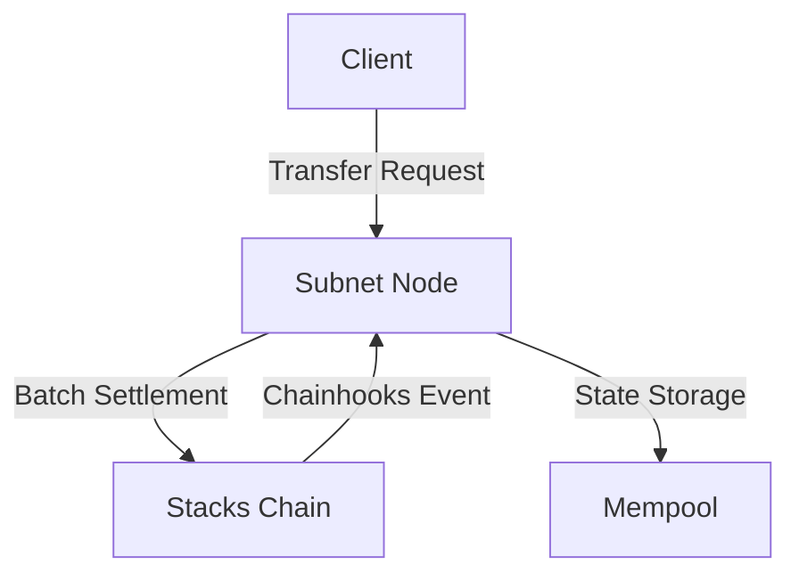
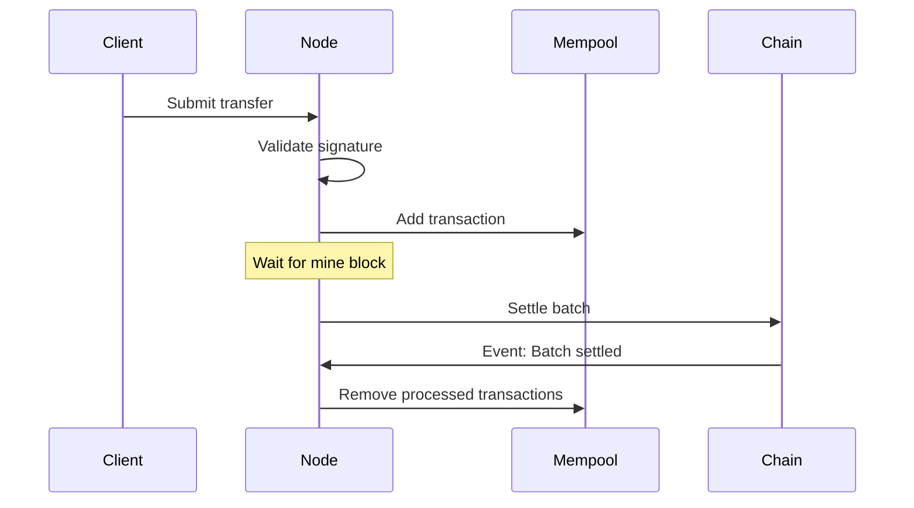
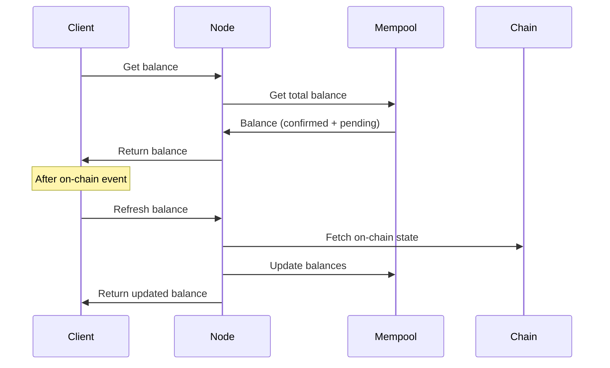

# Blaze Subnet Technical Architecture

This document outlines the technical architecture of the Blaze subnet system, including its components, data flow, and key technical decisions.

## System Overview

Blaze is a layer 2 scaling solution for Stacks that enables fast, off-chain transfers with on-chain settlement. It uses a subnet architecture where operators process transfers off-chain and periodically settle them on-chain in batches.



## Core Components

### 1. Client SDK

The client SDK provides a simple interface for applications to interact with Blaze subnets:

```typescript
class Blaze {
    // Wallet management
    async connectWallet(): Promise<string>
    disconnectWallet(): void
    isWalletConnected(): boolean
    getWalletAddress(): string
    
    // Core operations
    async transfer(options: TransferOptions): Promise<TransactionResult>
    async deposit(amount: number): Promise<TransactionResult>
    async withdraw(amount: number): Promise<TransactionResult>
    
    // Balance management
    async getBalance(): Promise<number>
    async refreshBalance(): Promise<number>
    
    // Block mining
    async mineBlock(batchSize?: number): Promise<TransactionResult>
}
```

Key features:
- Structured data signing for transfers
- Simple numeric balance representation
- Manual balance refreshing
- Explicit block mining

### 2. Subnet Node

The subnet node is responsible for:
- Processing transfer requests
- Managing the transaction mempool
- Batch settlement on-chain
- Balance tracking and management

```typescript
class Subnet {
    // Core operations
    async processTxRequest(txRequest: Transfer): Promise<void>
    async mineBlock(batchSize?: number): Promise<TransactionResult>
    
    // Balance management
    async getBalance(user?: string): Promise<number>
    async getBalances(): Promise<Record<string, number>>
    async refreshBalances(user?: string): Promise<void>
    
    // On-chain operations
    async deposit(amount: number): Promise<TransactionResult>
    async withdraw(amount: number): Promise<TransactionResult>
}
```

### 3. Mempool

The mempool manages unconfirmed transactions waiting to be mined into blocks:

```typescript
class Mempool {
    // Transaction management
    getQueue(): Transaction[]
    addTransaction(transaction: Transaction): void
    getBatchToMine(maxBatchSize?: number): Transaction[]
    removeProcessedTransactions(count: number): void
    
    // Balance calculations
    getPendingBalanceChanges(): Map<string, number>
    getTotalBalances(): Map<string, number>
    async getBalance(user: string): Promise<number>
}
```

## Data Flow

### 1. Transfer Flow



### 2. Balance Management



## Technical Decisions

### 1. Mempool-Based Architecture

**Decision**: Use an in-memory transaction pool (mempool)
- Simple and efficient transaction management
- Clear separation between confirmed and pending transactions
- Familiar model for blockchain developers
- Enables efficient batch mining

### 2. Balance Simplification

**Decision**: Use single numeric balance values
- Simpler API for developers
- Less cognitive overhead
- Still maintains internal tracking of confirmed vs. pending
- Manual refresh when needed for on-chain updates

### 3. Batch Processing

**Decision**: Queue-based batch processing
- Configurable batch size
- Manual or scheduled mining triggers
- Automatic queue management
- Error recovery

## Security Model

### 1. Transfer Security

Each transfer is secured by:
1. Structured data signature
2. On-chain signature verification
3. Balance checks
4. Nonce handling

### 2. Node Security

Nodes are secured through:
1. Private key management
2. Rate limiting
3. API authentication
4. SSL/TLS encryption

## Performance Characteristics

### 1. Throughput

- Each batch transaction can contain up to 200 transfers
- Stacks blocks confirm every 5-30 seconds on average
- Multiple batch transactions can be included in each Stacks block
- Theoretical maximum: Up to millions of transfers per day per node
  - Example: At 10 seconds per block with 5 batch transactions per block
  - 5 batches × 200 transfers = 1,000 transfers per block
  - 8,640 blocks per day = 8,640,000 transfers per day
  - Limited only by Stacks blockchain block capacity and fee considerations

### 2. Latency

- Transfer submission: < 100ms
- Batch settlement: ~10-40 seconds (depends on Stacks block time)

### 3. Scalability

The system can scale through:
1. Multiple subnet nodes
2. Increased batch sizes
3. Optimized batching strategies (multiple batches per block)
4. Parallel batch submission

## Evolution Path

### 1. Multi-Token Support

Blaze is designed to evolve beyond its initial implementation to support multiple tokens:

**sBTC Support**
- Adding sBTC-specific subnet contracts
- sBTC-specific transaction handling
- Cross-subnet atomic operations

**Token-Specific Subnets**
- Each token can have its own subnet
- Token-specific optimization parameters
- Custom fee structures

### 2. Backend-Driven Applications

Subnets can enable entirely new application patterns by handling logic at the subnet operator level. This allows for complex off-chain computations while leveraging blockchain for settlement.

**Example: Subnet-Powered Lottery**

```typescript
// Simplified lottery implementation using Blaze subnet

// Configuration
const TICKET_PRICE = 100;
const MAX_TICKETS = 199;
const PRIZE_PERCENTAGE = 0.99; // 99% goes to winner
const participants = new Map(); // Stores address -> number of tickets

// Process a ticket purchase transaction
async function processTicketPurchase(subnet, tx) {
  // Validate transaction is a ticket purchase
  if (tx.to !== subnet.getAddress() || tx.amount % TICKET_PRICE !== 0) {
    throw new Error("Invalid ticket purchase");
  }
  
  // Calculate number of tickets purchased
  const tickets = tx.amount / TICKET_PRICE;
  
  // Record participant tickets
  const currentTickets = participants.get(tx.from) || 0;
  participants.set(tx.from, currentTickets + tickets);
  
  // Add transaction to mempool
  await subnet.processTxRequest(tx);
  
  // Check if lottery is ready to be finalized
  if (subnet.mempool.getQueue().length >= MAX_TICKETS) {
    await finalizeLottery(subnet);
  }
}

// Select winner and distribute prize
async function finalizeLottery(subnet) {
  // Calculate total sales from transactions in mempool
  const totalSales = subnet.mempool.getQueue()
    .reduce((sum, tx) => sum + tx.amount, 0);
  
  // Calculate prize amount (99% of total sales)
  const prize = Math.floor(totalSales * PRIZE_PERCENTAGE);
  
  // Select winner
  const winner = selectRandomWinner();
  
  // Create winner payout transaction
  const payoutTx = {
    from: subnet.getAddress(),
    to: winner,
    amount: prize,
    nonce: Date.now(),
    signature: subnet.signTransaction(winner, prize)
  };
  
  // Add payout to mempool
  await subnet.processTxRequest(payoutTx);
  
  // Mine the block to settle on-chain
  await subnet.mineBlock();
  
  // Reset for next lottery
  participants.clear();
}

// Select winner based on tickets purchased
function selectRandomWinner() {
  // Create array with one entry per ticket
  const tickets = [];
  
  for (const [address, ticketCount] of participants.entries()) {
    // Add address to tickets array once per ticket purchased
    for (let i = 0; i < ticketCount; i++) {
      tickets.push(address);
    }
  }
  
  // Random selection (one ticket = one chance to win)
  const randomIndex = Math.floor(Math.random() * tickets.length);
  return tickets[randomIndex];
}

// Usage example
// subnet.on('transaction', tx => processTicketPurchase(subnet, tx));
```

> **Security Caveat for Games of Chance**: 
> When implementing games of chance like this lottery example, game hosts should be aware of potential frontrunning attacks. Participants could monitor pending batches and attempt to withdraw their funds before the batch is confirmed if they don't win, undermining the integrity of the game. 
>
> Consider implementing one or more of these mitigation strategies:
> 
> 1. **Confirmation-Based Rewards**: Wait for batch confirmation on the Stacks chain before calculating and issuing rewards
> 2. **Frontrunner Detection**: Monitor pending Stacks transactions for the subnet to detect potential frontrunners and exclude them from prize eligibility
> 3. **Smart Contract Custody**: Implement a subnet-enabled smart contract that can custody funds between game rounds, rather than relying solely on the subnet operator as an escrow custodian
> 4. **Participation Commitments**: Require participants to lock their funds for a minimum time period that exceeds the expected settlement time

With this approach:
1. The subnet operator runs application-specific logic
2. User funds remain in the subnet until settlement
3. Complex computations (like random selection) happen off-chain
4. Final state (lottery results) is settled on-chain in a single batch
5. No need for complex smart contract logic

### 3. Application Integration

To make applications subnet-compatible:

1. **Add Signature-Based Endpoints**:
   - Create signed variants of transaction methods
   - Support structured data signing
   - Verify signatures on-chain

2. **Token Contract Integration**:
   - Token contracts can implement subnet interfaces
   - Add `signer-transfer` methods
   - Support batch processing

3. **User Experience**:
   - Present subnet operations as "instant" options
   - Show confirmation status
   - Provide manual refresh options

## Implementation Guidelines for Existing Stacks dApps

Existing Clarity smart contracts can be upgraded to support subnet-based operations using three different integration approaches:

### 1. Standard On-Chain Approach

This is the traditional approach used by most Stacks dApps today, where all operations happen directly on the Stacks blockchain:

```clarity
;; Standard function - fully on-chain
(define-public (swap-a-to-b (amount uint))
  (begin
    (try! (contract-call? 'ST1234.token-a transfer amount tx-sender (as-contract tx-sender)))
    (try! (contract-call? 'ST1234.token-b transfer (calculate-amount amount) (as-contract tx-sender) tx-sender))
    (ok true)))
```

**How it works:**
- Transactions are submitted directly to the Stacks blockchain
- Typical confirmation time of 5-30 seconds
- Standard gas fees apply to each transaction
- No subnet integration

**Best for:**
- Native integration with wallets
- Low transaction volume applications
- When settlement finality is more important than speed

### 2. Subnet Contract Integration

This approach integrates with subnet-compatible token contracts while still using standard Stacks transaction flow:

```clarity
;; Subnet-enabled option 1 (stacks mempool, standard balance updates)
(define-public (swap-a-to-b (amount uint))
  (begin
    (try! (contract-call? 'ST1234.token-a-subnet transfer amount tx-sender (as-contract tx-sender)))
    (try! (contract-call? 'ST1234.token-b transfer (calculate-amount amount) (as-contract tx-sender) tx-sender))
    (ok true)))
```

**How it works:**
- Wallet signs a normal transaction and sends to Stacks mempool
- The first token contract (`token-a-subnet`) is subnet-aware
- Confirmation still requires Stacks blockchain settlement (5-30 seconds)
- Subnet tokens can still be transfered like normal tokens, btw
- Standard transaction signing model (no specialized signatures)

**Best for:**
- Partial subnet integration with minimal code changes
- Applications with mixed token types (some subnet-compatible, some standard)
- Incremental adoption of subnet technology
- Maintaining compatibility with existing wallets

### 3. Signature-Based Subnet Integration

This approach fully leverages the Blaze mempool for high-throughput, instant operations:

```clarity
;; Subnet-enabled option 2 (blaze mempool, instant balance updates)
(define-public (swap-a-to-b-signed (signature (buff 65)) (nonce uint) (amount uint))
  (let (
    (signer (derive-signer signature amount nonce))
  )
    (try! (contract-call? 'ST1234.token-a-subnet signer-transfer signature (as-contract tx-sender) amount nonce))
    (try! (contract-call? 'ST1234.token-b transfer (calculate-amount amount) (as-contract tx-sender) signer))
    (ok true)))
```

**How it works:**
- Uses structured data signatures to authorize transfers off-chain
- The `signature` parameter contains a signed message from the user authorizing the transfer
- The contract verifies the signature cryptographically to derive the signer
- Transactions can be processed instantly in the Blaze mempool before on-chain settlement
- Balances update immediately- the Blaze subnet credits the balance changes from the swap to both parties
- Transaction batching happens behind the scenes
- Settlement occurs when the subnet mines a block (every few seconds to minutes)

**Best for:**
- High-volume transaction applications
- Interactive user experiences requiring immediate feedback
- Applications with high transaction volumes
- Gaming or interactive applications
- Cost-sensitive applications (batching reduces per-transaction cost)

**Not for:**
- Front running or other scenarios that would call for high-fees 
- Use cases where time-to-settle on Stacks is of upmost importance

## Conclusion

Blaze provides a flexible, extensible framework for layer 2 scaling on Stacks. By following the integration patterns outlined above, developers can create high-volume, high-throughput dapps that maintain blockchain security while providing near-instant web2-like user experiences.